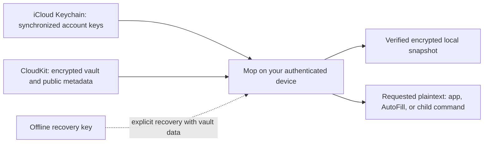

# How Mop protects your secrets

Mop keeps passwords and other secrets encrypted, synchronizes them through your
Apple Account, and decrypts them on your device when you authorize access. It can
then fill a password or supply a secret to a command. Understanding where that
protection starts and ends matters more than memorizing algorithm names.

This guide assumes you understand files, processes, and APIs, but not cryptography
or Apple's security services. It describes the current v5 implementation.
Offline editing, passkeys, and shared vaults are future possibilities, not current
capabilities. The [roadmap](ROADMAP.md) describes that direction; the
[security reference](SECURITY.md) provides implementation details.

## What problem does a vault solve?

A token in a shell script, a checked-in `.env` file, or a copied configuration
file can spread into source history, backups, logs, and other people's machines.
A vault lets you store the secret centrally and put a reference in those places:

```sh
API_TOKEN=mop://personal/service/token mop run -- ./my-tool
```

Here the reference is an address, not a password or an access grant. Knowing it
does not let someone open the vault. It can still reveal names you consider
sensitive, such as a client or service name.

After authentication, Mop resolves the reference and starts `my-tool` with the
actual token in its environment. That avoids keeping the token in the script.
It also means `my-tool` receives the token and can use, copy, or leak it. A vault
protects storage and controls delivery; it cannot make an untrusted program safe
to receive credentials.

## The few security terms you need

| Term | Meaning here |
|---|---|
| Plaintext | The original readable value, such as an API token. It need not be ordinary prose. |
| Ciphertext | The encrypted bytes that can be stored or transmitted without revealing the value to someone who lacks the key. |
| Encryption key | Secret random data used to encrypt or decrypt. Mop generates these keys; your fingerprint is not one. |
| Public/private key pair | Related keys: the public part can be distributed; the private part must stay secret. Mop uses separate pairs for encryption and signing. |
| Wrapping a key | Encrypting a data-encryption key so a particular recipient can recover it with their private key. |
| Signature | Evidence that someone with an authorized signing key approved particular bytes. It detects changes but does not hide the bytes. |
| Fingerprint | A short identifier calculated from key material, used to check that you have the expected key. It is not a decryption key or a biometric fingerprint. |
| Authentication | Checking that the person using the device is allowed to proceed. |

Three different properties matter: **confidentiality** keeps values private,
**integrity** detects unauthorized changes, and **availability** means you can
get your data when needed. Encryption alone does not provide all three. A server
can delete perfectly encrypted data without ever learning its contents.

## What is stored where?

Apple provides several services with similar names. Mop gives them different jobs.

| Component | Job in Mop |
|---|---|
| CloudKit | Apple's database service. Holds encrypted vault records and revisions in the private database associated with your Apple Account. This is not an iCloud Drive folder. |
| Keychain | The operating system's protected storage for small secrets. Holds Mop's account private keys, restricted to the app's authorized access group. |
| iCloud Keychain | Synchronizes those private keys to your other approved Apple devices. It is a different path from Mop uploading vault records to CloudKit. |
| Local Mop storage | Holds encrypted snapshots for offline use, remembered trust information, and records of unfinished cloud operations. |
| Recovery file | Holds an alternative private key capable of opening one vault. You keep it separately. |



The diagram separates the key path from the vault-data path. Mop's account
private keys are not uploaded as records in its CloudKit vault. Apple describes
iCloud Keychain synchronization as end-to-end encrypted: the synchronized
contents are protected from Apple in that service's design.
See [Apple's iCloud Keychain overview](https://support.apple.com/guide/security/icloud-keychain-security-overview-sec1c89c6f3b/web).

Mop therefore depends on Apple for account and device security, key delivery,
storage, and operating-system enforcement. It removes a separate password-manager
service from the picture; it does not remove Apple from the trust model.

## How does a password get encrypted?

Each vault has an encrypted catalog of its items and fields. Passwords, OTP seeds,
and other concealed values have separate encrypted records. The catalog has its
own random encryption key, and each secret record has an independent random key.
Replacement values receive fresh record IDs and keys.

Those keys are wrapped for two recipients: your account identity and that vault's
recovery credential. Either recipient can recover the keys and decrypt the data.
You do not need both at once. Your account identity can open your owned vaults;
each recovery credential applies to its corresponding vault.

For readers who want the names, Mop uses AES-256-GCM for data encryption and
Apple's CryptoKit implementation of HPKE with P-256, SHA-256, and AES-GCM for key
wrapping. AES-GCM also checks that encrypted data has not been altered. Signed
membership and signed revisions establish who is authorized and which contents
they approved. Details are in [the security reference](SECURITY.md).

Using established algorithms is useful, but correct key handling, parsing,
authentication, and recovery are just as necessary. Algorithm names are not a
security certification.

## If there is no master password, what unlocks it?

Mop generates an account identity containing private encryption and signing keys
and stores it in synchronizable Keychain storage. It asks the operating system
to authenticate you before loading that identity. The system can accept Touch ID,
Face ID, or the device's password/passcode fallback.

Your biometric check grants permission to proceed. It does not derive an
encryption key from your finger or face. Changing enrolled biometrics does not
change Mop's synchronized account keys, and Mop has no biometric-only setting.

The native app retains authorization for an unlocked session, with a configurable
inactivity timeout of 1–60 minutes, defaulting to five. CLI secret commands
authenticate for each command. AutoFill authenticates for every fill, including
username-only insertion. Locking ends Mop's access through that session; it cannot
recall a value already handed to another process or guarantee removal of every
copy from memory.

**The application enforces the authentication prompt.** The account Keychain item
is available to authorized app code while the device is unlocked; it does not
have a separate Keychain rule demanding a fresh biometric check for every key
read. Compromised authorized Mop code is therefore outside the protection this
design provides.

## Are the keys inside the Secure Enclave?

Mop's account private keys are synchronized software keys. They are not
non-exportable keys tied to a single device's Secure Enclave. Authorized Mop code
can load them into process memory after authentication.

The Secure Enclave is an isolated security subsystem used by Apple devices for
tasks including protecting biometric authentication. Using Touch ID does not
automatically mean every application key stays inside it. See
[Apple's Secure Enclave description](https://support.apple.com/guide/security/secure-enclave-sec59b0b31ff/web).

The choice enables your devices to receive the same Mop identity without a
Mop-specific pairing process. It also means Mop cannot independently revoke one
device's copy of that identity.

## Can Apple or someone who steals the cloud records read my passwords?

Possession of Mop's CloudKit records alone is insufficient to decrypt the vault.
Mop encrypts contents before upload, so confidentiality does not depend on enabling
Apple's optional Advanced Data Protection setting. iCloud Keychain's protection
of the account keys is still part of the design.

CloudKit does see vault names, identifiers, public membership/key information,
record sizes and counts, and update timing. Item names, field names, and values
are encrypted in the vault. Choose vault names with that distinction in mind.

This is a claim about stored cloud records, not protection against a compromised
operating system, a malicious authorized Mop build, or an attacker who obtains
your private identity or recovery key. The running app must be trusted because
it eventually handles decrypted values.

There is also a deliberate **local AutoFill exception for metadata**: Mop publishes
eligible website and username suggestions to the system and a shared local index
readable by its extension before vault authentication. Passwords and OTP seeds
remain encrypted. The picker can show accounts while locked, but filling a value
requires authentication. See [AutoFill storage and behavior](AUTOFILL.md).

## Does opening the app decrypt every password?

Opening the catalog makes item information and visible field values available
without decrypting every concealed record. Search uses that catalog; it does not
read all password records. Revealing, copying, filling, or otherwise requesting a
secret decrypts its record as needed. Displaying a current OTP code requires
access to that OTP's secret too.

“Visible” describes how a field behaves after unlocking, not how it is stored in
the vault. Visible fields remain encrypted in vault storage. Conversely,
concealing a value on screen does not mean it has never entered memory: editing
a password loads its value, for example.

This separation reduces unnecessary decryption. It is not a permission boundary
against compromised code that already has the authorized account identity.

## How does a second device get access?

Sign in to the same Apple Account, enable iCloud Passwords & Keychain, and install
a properly provisioned Mop build. CloudKit supplies vault data; iCloud Keychain
delivers the account identity. Mop verifies the vault against that identity before
trusting it. There is no additional Mop enrollment or QR pairing step.

Those deliveries can arrive at different times. If a vault is visible but the
identity has not arrived, Mop waits or reports an error. Creating replacement
keys automatically would not open the existing data and could split your devices
between incompatible identities. Apple documents its device synchronization in
[secure Keychain syncing](https://support.apple.com/guide/security/secure-keychain-syncing-sec0a319b35f/web).

Every device that receives the account identity has the owner's access. Mop has
no per-device revoke button or implemented account-key rotation. Ending an
account session is not proof that every prior device copy has been erased.
If credentials have escaped, changing the affected password or token at the
service that issued it is what makes that old credential stop working.

## Why does installing or building Mop involve Apple signing?

A code signature identifies the software publisher and detects changes to the
signed application. Entitlements are permissions attached to the signed app, such
as access to a particular CloudKit container or Keychain group. Provisioning
authorizes the app to use those capabilities.

These checks prevent an arbitrary app from simply claiming Mop's Keychain access
group. They do not prove the authorized app has no bugs or malicious behavior.
Mop's normal CLI is part of the signed app bundle; the installed command links to
that executable. Copying the executable out of the bundle breaks that setup.

An independently signed fork does not automatically inherit the official app's
key access or cloud container. Open source permits independent builds; it does
not bypass Apple's access controls. Migration and recovery remain important.

## How does synchronization avoid losing changes?

Mop treats a saved vault as a revision, similar to a versioned document. It first
uploads the new encrypted records and revision description. Only then does it
update the small record that says which revision is current.

That final update succeeds only if the current revision has not changed since
Mop read it. If your Mac and phone both edit the same starting revision, one can
publish and the stale writer gets a conflict. Today this protection is at vault
revision level; even edits to different items can conflict. Mop does not silently
merge them or let the last writer overwrite the other writer.

If the connection drops after sending the final update, Mop may not know whether
the server accepted it. It records enough information locally to check later with
`mop vault sync`. That journal resolves an uncertain online operation; it is not
a queue of offline edits to replay. Uploaded but unpublished records do not become
the current vault.

Signatures detect unauthorized changes, but an old authentic revision still has
a valid signature. Mop remembers verified revision information locally to reject
rollbacks it can recognize. A fresh device with no such history cannot always
tell that the server withheld a newer revision. Nor can signatures force the
server to return data at all.

## Does offline access have to be read-only?

No. This is a current implementation choice, not an encryption requirement.

Today, an authenticated online opening produces a verified encrypted snapshot.
The app can use that snapshot when disconnected; the CLI requires `--offline`.
An unverified background download does not become trusted simply because it is
on disk. Account, permission, and integrity failures are not treated as ordinary
network outages that justify falling back to cached data.

An offline device cannot learn about changes it has not received. AutoFill also
uses the last snapshot exported by the app, rather than fetching the cloud on
each fill. Neither can promise the latest remote value while disconnected.

Offline editing could save an encrypted local change and upload it later.
However, “send it to iCloud when online” needs durable local storage, pending-sync
status, retries, and a decision when another device changed the same data. For
example, two devices might independently replace the same password. Silently
discarding either version could discard the one that works at the website.

Apple offers synchronization machinery such as
[CKSyncEngine](https://developer.apple.com/documentation/cloudkit/cksyncengine-5sie5),
but applications still handle their data and conflicts. Mop currently uses direct
CloudKit operations and its own publication protocol, not CKSyncEngine. CloudKit
cannot inspect and merge Mop's encrypted passwords. The [roadmap](ROADMAP.md)
plans offline edits without claiming they exist today.

## What escapes the vault when I use a secret?

| Action | Where plaintext goes |
|---|---|
| `mop read` | Standard output, or the requested output file. Terminal scrollback and pipelines can retain it. |
| `mop run` | The child process environment and memory, and potentially its descendants or other destinations it writes. |
| `mop inject` | The rendered output. A generated configuration file contains actual secrets. |
| Copy | The system clipboard, where other software may observe it. |
| AutoFill | The system's filling mechanism and the destination receiving the value. |

`mop run` masks exact fetched-secret byte sequences on standard output and standard
error. That helps prevent accidental log exposure. It does not catch every
encoding, substring, network request, file write, or direct terminal write.
`--no-masking` disables even that protection. Masking is not a sandbox.

Mop does not accept secret values as positional arguments for writes; use its
hidden prompt or stdin. Command substitution into another tool's arguments can
still expose the secret through that tool's argument handling. Avoid assuming
that a command is safe merely because Mop supplied the value.

Secret output files default to owner-only permissions (`0600`) and use atomic
writes. They still contain plaintext. Concealed clipboard copies are marked
device-local and expire after 30 seconds; macOS clearing depends on Mop running.
Expiry cannot erase a copy another application already captured.

## Are OTP codes the same thing as passwords or passkeys?

A time-based one-time password (TOTP) is calculated from a stored secret seed and
the current time. Mop's normal reads, injection, and AutoFill return the current
code rather than the seed. Anyone who obtains the seed can generate future codes.
Keeping both password and seed in one vault is convenient, but compromising that
vault can expose both; a separate authenticator provides a separate storage
boundary.

Passkeys instead use a site's public/private-key authentication protocol. Adding
them is a separate credential capability, not a prerequisite for encrypting a
password vault. Mop currently fills passwords and TOTP codes, not passkeys.

## What do I need to recover my data?

Plan to preserve three things:

1. **An encrypted vault export:** the data to recover if the cloud copy is lost.
2. **That vault's recovery credential:** an alternative private key that can
   decrypt it when the account identity is unavailable.
3. **Independently recorded trust evidence:** the vault fingerprint, or supported
   revision evidence, to check that recovery is using the expected vault.

The recovery file contains an unencrypted private key encoded as text. Encoding
is not encryption. Someone with that key and the corresponding encrypted vault
can decrypt it without your Mop biometric prompt. Keep the key offline and
separate from the backup; keep trusted fingerprint evidence independent of the
source you might later need to verify. A fingerprint is not secret, but replacing
both a backup and its supposed proof undermines that check.

A recovery key does not contain the passwords. An encrypted export does not
contain the private key needed to open it. A verified owned backup can also be
opened through the existing account identity, but relying only on that identity
does not cover losing access to it.

Current recovery can transfer a vault to another usable account identity, rotating
vault keys when ownership changes. It does not silently replace a missing identity
for the original Apple Account. If all devices lose that identity, use Apple's
Keychain recovery or the explicit backup/recovery route to an account with a
usable Mop identity. See [account recovery behavior](ACCOUNT-IDENTITY.md).

## Does deleting or changing a password erase the old one?

No. A change creates a new revision; historical encrypted revisions and exported
backups can retain previous values. Recently Deleted permits item restoration
for 30 days, but expiry is not a promise to erase historical copies.

Deleting a vault removes its CloudKit zone and, after confirmation, this device's
local vault state. It does not remove exported backups or caches on other devices.
Changing encryption keys cannot make someone forget plaintext already obtained.
Changing a saved password in Mop also does not change the password at the website;
those are separate operations.

## Why aren't shared vaults just another sync option?

Syncing your devices uses one owner identity. Sharing with another person requires
deciding which different identity is authorized, how an invitation is verified,
what that person may edit, and what happens to keys and recovery when they leave.
Access to cloud records alone should not decide who can decrypt or sign a vault.

Mop currently supports one owner and one recovery recipient per vault, not
cross-account collaboration. Future sharing needs both cryptographic authorization
and cloud access rules. Revoking membership can restrict future access; it cannot
retract passwords a former member already copied.

## What does open source establish about security?

It makes the implementation available for inspection and independent maintenance.
It does not establish that someone reviewed every path, that every distributed
binary matches the source, or that the application is free of vulnerabilities.
Likewise, signing or App Store distribution is not a cryptographic audit.

Mop uses automated tests and records security reviews, but those reports describe
particular snapshots. Simulators and fake cloud services cannot prove real
Keychain delivery, biometric behavior, or production synchronization. Consult
[validation and release acceptance](VALIDATION.md) for the evidence and remaining
checks rather than treating this explanation as certification.

For implementation detail, continue with [security and key management](SECURITY.md),
[account identities](ACCOUNT-IDENTITY.md), and
[CloudKit publication and acceptance](CLOUDKIT.md). For intended future changes,
see [the roadmap](ROADMAP.md).
