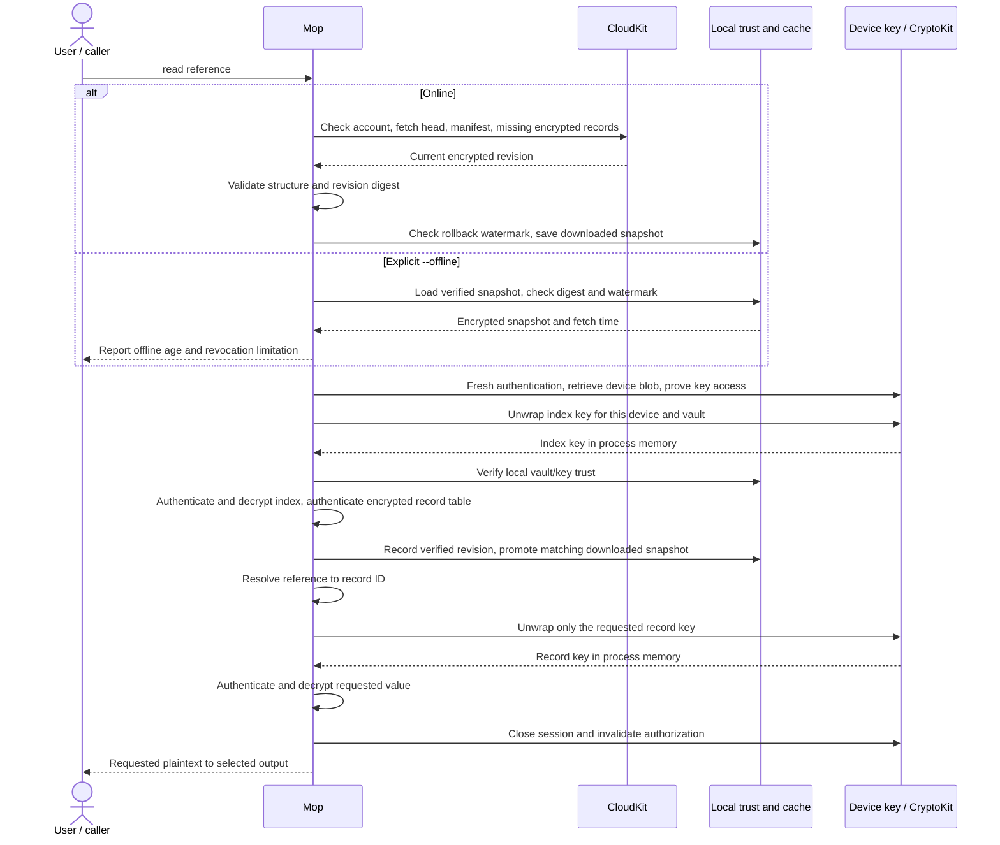
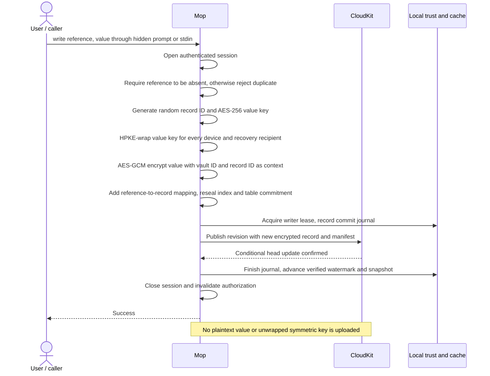
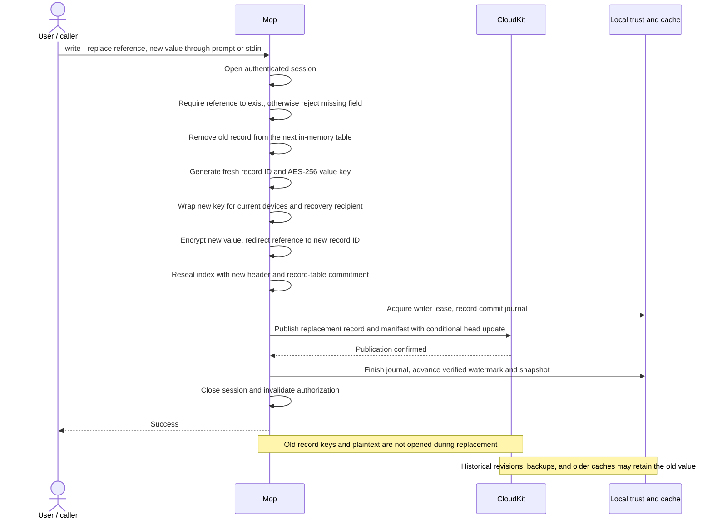
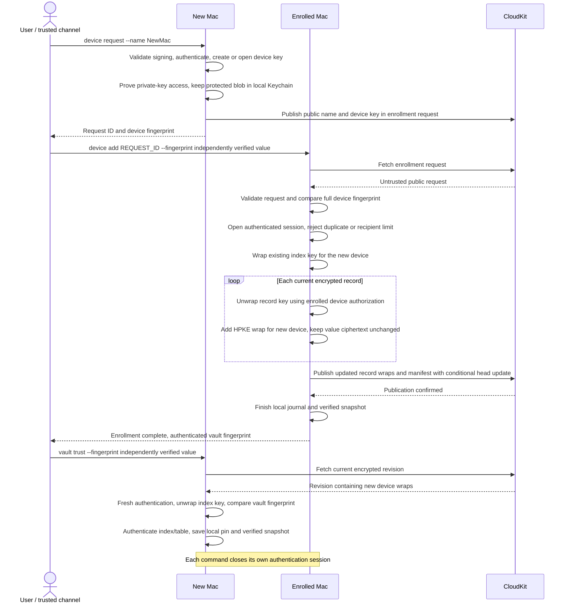
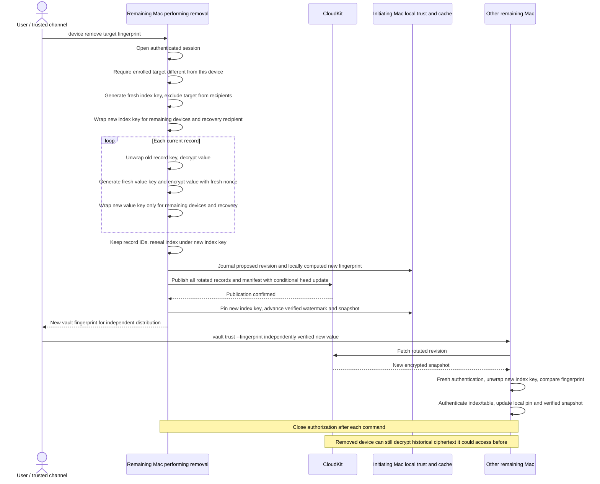

# Security and key management

This guide describes the current CloudKit-backed CLI and native Mac app. See
[validation](VALIDATION.md) for executed tests and outstanding hardware/multi-Mac
acceptance, and the [security audit](security-audit/2026-09-23.md) for the reviewed
snapshot and subsequent remediation. Testing does not establish that all attacks
or deployment configurations have been independently audited.

## Protection boundaries

Mop protects secret confidentiality and integrity when encrypted cloud records or
backups are disclosed or replaced without the necessary keys and local trust.
CloudKit encryption supplements Mop's own encryption; Advanced Data Protection is
not required for that encryption boundary. The service can observe public device
metadata, vault IDs, record counts, sizes, update timing, and record reuse. It can
delete data or withhold changes. There is no padding or global freshness oracle.

The system assumes a trustworthy OS, signed application, local state, and
user-approved receiving programs. It cannot protect plaintext from a compromised
authorized process, malware running as the user, or an authorized child to which
secrets were explicitly supplied. Signing identifies the application, not the
shell program invoking it or the user's understanding of an authentication prompt.

There is no administrator/read-only enrollment distinction: every enrolled device
can access every record in that independent vault. A compromised authenticated
process can unwrap other record keys. The recovery private key is a full alternate
decryption capability; it does not require the original Mac, enclave, or biometrics.

## Storage and account binding

Operational storage is CloudKit. `--vault-file` and `MOP_VAULT_FILE` are rejected;
use explicit `vault import --file` to migrate a v3 file. Select an independent vault
by `--cloud-vault UUID`, then `MOP_CLOUD_VAULT`, then the account-scoped saved default.
The logical vault name inside `mop://personal/service/token` is a namespace within
that selected independent vault, not a separate CloudKit authorization boundary.

| Material | Location and handling |
|---|---|
| Encrypted records and manifests | Private CloudKit zone per independent vault UUID. Immutable encrypted records are referenced by revision manifests; a conditional head update publishes a revision. |
| Index and value keys | Random AES-256 keys, independently wrapped per device and recovery recipient. Only requested record keys are unwrapped during ordinary reads. |
| Device private-key representation | Application-specific Data Protection Keychain, service `mop.device-key.v2`. Opaque enclave blob; nonsynchronizing, authentication protected, this-device-only. |
| Device metadata | `~/.mop/device.json`: public key, display name, Keychain account UUID, and authentication policy. No private-key blob. |
| Local account binding, trust, snapshots, journals | Under `~/.mop/cloud/`, scoped by container, environment, account, and vault UUID. Never synchronize the state directory. Its integrity matters even though it contains no plaintext secrets or recovery private key. |
| Recovery credential | User-selected file containing `mop-recovery-v1:` plus an exportable P-256 private key in Base64. Base64 is not encryption. Move offline and keep separate from synchronized ciphertext/backups. |
| Encrypted export | User-selected `.mopfile` from `vault export`. Complete encrypted v3 snapshot, without the recovery private key. Retain independent trust evidence and the vault UUID. |

`--state-directory` or `MOP_STATE_DIRECTORY` overrides `~/.mop`. Preserve the device
metadata, Keychain item, and local trust across upgrades. A new directory does not
revoke an old device; deleting metadata does not delete its Keychain item.
An observed sign-out invalidates the local account binding. Online operations check
the current account; offline use cannot detect an account change not observed locally.

Snapshot documents are limited to 16 MiB. Local storage retains one downloaded and
one verified snapshot, each capped at 32 MiB including its JSON/Base64 envelope.
Atomic replacement can temporarily retain one additional envelope. Unverified
network records are assembled in bounded memory and do not create persistent blob
files. Incremental fetches reuse records embedded in the two snapshots. Opening a
cache removes obsolete hash-named `.blob` files from earlier versions while keeping
snapshots and commit journals. This is a per-vault bound, not an aggregate limit
across all selected accounts/vaults. Cloud history and abandoned server uploads are
not automatically pruned and continue to count toward the cloud quota.

## Authentication and signing

Every command that accesses secrets or authenticated metadata creates a fresh
`LAContext`, sets Touch ID reuse duration to zero, and evaluates owner
authentication. Additional prompting on that context is disabled after success.
The same authorization must satisfy the Keychain item and Secure Enclave key ACLs;
there is no software-key fallback or weaker retry. Opening a local device performs
a test wrap/unwrap to prove private-key access even for public device management.
Contexts are invalidated when the command closes or authentication fails.

The default key and item use `WhenUnlockedThisDeviceOnly` and user presence; the
enclave key also requires private-key usage. Touch ID or the login password may
authorize access. `--strict-biometrics` when creating a device uses
`biometryCurrentSet` and biometrics-only authentication with no password fallback.
Changing biometric enrollment then requires recovery. An existing non-strict key
cannot silently become strict; changing policy requires a new device key and
revocation of the old one. Editing metadata cannot weaken the OS-enforced ACLs.

Operational access requires the provisioned signed bundle. Validation requires a
narrow application-specific Keychain access group, hardened runtime, a matching
bundle, and an embedded provisioning profile, and rejects the supported debugging
and library-validation exceptions. The CLI helper also validates the enclosing
bundle seal. Keep the application identifier, team, and CloudKit container stable.
Do not extract the executable from the app bundle for installation.

The opaque enclave blob is protected by the Keychain access group. It is not
intrinsically app-bound once extracted by compromised authorized code; hardware
and its ACL still restrict its use. Loss of the Keychain item or enclave state
requires recovery even if public device metadata remains.

Help, completions, ciphertext sync/status/history, public enrollment-request
listing, and commands with no secret references do not unlock secret values.
Public enrollment metadata is not authenticated identity evidence.

## Encryption and integrity

An AES-256-GCM index key encrypts canonical reference names and random record IDs.
Every secret has an independent random AES-256-GCM value key. CryptoKit HPKE
`P256_SHA256_AES_GCM_256` wraps the index key and each value key separately for each
enrolled device and one offline recovery recipient.

- HPKE context binds the v3 domain, vault UUID, recipient role/fingerprint, and
  purpose (`index` or `record:UUID`). Index and record wraps cannot be interchanged.
- Index associated data authenticates the complete header and a SHA-256 digest of
  the canonical encrypted record table, including wrapped keys. It binds table
  membership and bytes without decrypting all values.
- Value associated data binds vault UUID and record ID. AES-GCM uses fresh random
  nonces. Replacement uses a fresh record ID/key; deletion does not decrypt old values.
- Canonical references must map one-to-one to the record table. Recipient lists,
  public keys, wrap sizes, generation, and document size are validated. Legacy
  document/device formats are rejected.

Listing decrypts only the index. Enrollment unwraps and rewraps record keys without
opening values. Revocation and history restoration process values individually.
The index key is an integrity authority: its holder can forge a header/index and
insert chosen records, though it cannot alone decrypt existing independent record
keys. There are no per-user signatures or enclave-enforced per-field allowlists.

## Security operation sequences

These sequences describe the operational CloudKit backend. The native app invokes
the same CLI commands. `Device key / CryptoKit` represents the authenticated
Keychain/enclave path together with CryptoKit's HPKE handling: the private device
key stays hardware-backed, but unwrapped symmetric keys and requested plaintext
exist in Mop's process memory. CloudKit receives ciphertext and public metadata.

The diagrams use two shared steps:

- **Open authenticated session:** validate signing and account/vault selection;
  fetch and reconstruct the current cloud revision (reusing cached ciphertext),
  reject observed rollback, and save the downloaded snapshot. Authenticate afresh,
  retrieve the protected device blob, prove enclave access, and unwrap the index
  key. Verify the local vault/key pin, authenticate the index and entire encrypted
  record table, then advance the verified watermark/snapshot. A pending rotation
  can finish trust using a fingerprint already recorded by a local operation;
  cloud-supplied metadata never establishes trust on its own.
- **Publish revision:** increment the generation, set the parent to the previous
  snapshot's digest, and reseal the index with associated data binding the new
  header/record table. Check that the server head still matches the opened
  snapshot, acquire the local writer lease, and journal the proposed revision.
  Upload changed encrypted records and the manifest, recheck the account, then
  conditionally update the head using its server version. Only server confirmation
  allows normal local completion: save the downloaded snapshot, finish any local
  rotation pin, and advance the verified watermark/snapshot.

All mutations require online access. Authentication, trust, or integrity failure
stops the operation. Concurrent head changes return a conflict rather than
silently overwriting another revision. If the publication response is lost, the
outcome is uncertain: retain the journal and run `vault sync` to reconcile, rather
than replaying the mutation. Uploaded records alone do not publish a revision.

### Reading a secret

`mop read mop://personal/service/token` authenticates the index and record table,
then unwraps and decrypts only the requested value. Other values remain encrypted.
The verified snapshot records index/table authentication; it does not mean every
individual value has been decrypted successfully.



Offline mode also checks the local account binding and any locally observable
sign-out. It never falls back from a failed online read, and cannot detect remote
revocation that happened after the cached revision. File-output validation occurs
before authentication; a failed read emits no secret output.

### Writing a new secret

`mop write mop://personal/service/token` reads the value from a hidden prompt or
stdin, then requires the reference to be absent. It generates a new record ID and
value key; the existing index key and other records remain unchanged.



Wrapping uses recipients' public keys, so creating a record does not require
unwrapping any existing value key. Only the new encrypted record and new manifest
need uploading; unchanged records are reused by hash.

### Replacing a secret

`mop write --replace mop://personal/service/token` requires the reference to exist.
It creates a fresh record ID/key and redirects the reference to the replacement;
it does not decrypt or modify the old record in place.



Failure before publication leaves the committed field unchanged. A lost publication
response can still mean the replacement committed; use the shared reconciliation
procedure. Replacing a vault value does not revoke the corresponding credential
at its external service.

### Adding a device

Enrollment has two independent trust decisions: an enrolled Mac approves the new
Mac's device key, then the new Mac verifies the vault key. Both comparisons use
fingerprints obtained through a trusted channel independent of CloudKit.



Enrollment does not decrypt values or rotate existing symmetric keys. Record blobs
change because their recipient wraps change, even though value ciphertext stays
the same. Publishing a request alone grants no access, and successful approval
does not delete the request. The new device receives access to current records;
it does not automatically gain wraps in historical revisions.

### Removing a device

`mop device remove DEVICE_FINGERPRINT` must run on another enrolled Mac. Simply
removing recipient slots would leave previously learned keys useful, so Mop rotates
the index key and every current value key before publishing.



The recovery recipient remains authorized. Remaining Macs fail ordinary opens
under their old pins until they independently trust the rotated key. The initiating
Mac can reconcile an interrupted rotation using the fingerprint in its local
journal; it must not derive approval from cloud metadata. New-key revisions exclude
the removed device, but offline copies and previously learned secrets cannot be
recalled. Rotate external credentials if that device may have exposed them.

## Trust and rollback

Public-key encryption alone does not authenticate a vault. Anyone with public
recipient keys can encrypt an attacker-chosen index key for those recipients.
Mop therefore verifies an independent local pin before accepting decrypted data.

| Evidence | Meaning |
|---|---|
| Device fingerprint | SHA-256 of the device P-256 public key. Compare independently before approving enrollment; it does not attest hardware or the display name. |
| Vault fingerprint | SHA-256 commitment to the v1 trust domain, vault UUID, and raw index key. Stable across writes/enrollment; changes on key rotation. |
| Revision hash | SHA-256 of exact serialized encrypted snapshot bytes. Changes on every revision and proves only those exact bytes. |

Cloud pins are local to the account/container/environment/vault binding. Ordinary
opens require the active fingerprint. Initialization establishes trust in a key
created locally; existing data requires an established pin or independently
obtained fingerprint/revision evidence. Explicit history restoration can use a
previous pin under its other current-authorization checks. Do not manufacture
approval evidence by hashing only a suspect cloud record or backup.

After authentication, a generation/digest watermark rejects lower generations and
a different revision at the same generation. Downloads alone do not advance it or
replace the verified offline snapshot. A new Mac cannot infer global freshness
from the cloud alone; a device that has not observed a newer revision may still
accept an older one. Local state modification/deletion can undermine these pins
and watermarks; they are not hardware-sealed monotonic counters.

## Enrollment, revocation, and recovery

Initialize and retain the printed vault UUID and fingerprint independently:

```sh
mop vault init --recovery-file /offline/mop-recovery.key --name 'First Mac'
mop vault list
mop vault use VAULT_UUID
```

Recovery material is written before cloud publication and retained if a later
step fails. Initialization prints the UUID to stderr before publication so an
interrupted creation can be reconciled. Do not discard recovery material or
blindly repeat initialization after an uncertain outcome.

On a new Mac, select the vault and publish its public request:

```sh
mop vault use VAULT_UUID
mop device request --name 'Second Mac'
```

On an enrolled Mac, independently compare the complete device fingerprint before
approval. Request names and fingerprints downloaded from the service are untrusted:

```sh
mop device requests
mop device add REQUEST_ID --fingerprint VERIFIED_DEVICE_FINGERPRINT
mop vault fingerprint
```

On the new Mac, independently compare and pin the vault fingerprint:

```sh
mop vault trust --fingerprint VERIFIED_VAULT_FINGERPRINT
```

Enrollment does not rotate keys. Removal rotates the index key and every current
value key, and prints a new vault fingerprint for the remaining Macs to verify and
pin independently. The issuing device cannot remove itself:

```sh
mop device list
mop device remove DEVICE_FINGERPRINT
```

Removed recipients can still decrypt old ciphertext, history, backups, and offline
caches, and retain values already learned. Rotate actual passwords/API tokens at
the provider if a device may have exposed them; vault-key rotation does not change
those credentials. There is no remote secure wipe.

Recovery enrolls the new Mac after local authentication and trust verification:

```sh
mop vault recover --recovery-file /offline/mop-recovery.key \
  --fingerprint VERIFIED_VAULT_FINGERPRINT --name 'Replacement Mac'
```

Recovery does not automatically remove lost devices or rotate the vault key.
Revoke them afterward. There is no recovery-key replacement command; if that
credential is compromised, create a new vault with a new recovery key and move
current secrets explicitly. Losing all device keys and recovery material makes
the data unrecoverable. Losing independent trust evidence is a separate problem;
successful recovery decryption does not bypass trust checks.

## Synchronization, offline reads, and backups

Online commands fetch the current head before opening a session. Writers stage
immutable blobs/manifests and publish with a server-conditional head update.
A stale writer fails with conflict exit code 11. A live local writer holds a process
lease; interrupted/uncertain writes are recorded in a journal and reconciled against
committed ancestry by online `vault sync`. Exit code 22 requires reconciliation
before another write. Interrupted staging is not replayed or exposed as a committed
vault. Missing cloud zones are never silently recreated by normal commands.

Explicit `--offline` reads use only the last authenticated snapshot, still require
local authentication, and report its fetch time. There is no implicit fallback
from a network failure, no offline mutation queue, and no way for offline use to
observe later revocation. `vault sync` alone downloads ciphertext without promoting
it to the authenticated snapshot.

```sh
mop vault sync
mop vault status
mop vault export --offline --out-file /path/to/backup.mopfile
mop vault import --file /path/to/backup.mopfile --fingerprint VERIFIED_VAULT_FINGERPRINT
mop vault conflicts
mop vault resolve --revision COMMITTED_REVISION_HASH
```

Import verifies established source-path trust or independent evidence, preserves
vault identity/recovery relationships, refuses an existing destination head, and
leaves the source untouched. A replacement Mac can add `--recovery-file` to import
and enroll before publication. Imports do not upload legacy `.history` directories.
Restoration selects only committed ancestry and retains current recipients/keys,
re-encrypting historical values for them. It cannot reinstate a revoked device.
Local trust completion and server publication are separate transactions; preserve
trusted evidence and reconcile if publication succeeds but local completion fails.

`VaultDisk`/`FileSecretStore` remain legacy adapter APIs for tests and migration.
Their path-scoped pins, filesystem coordination, `.history` files, and lack of
same-key generation watermarks do not describe the operational CloudKit backend.

## Plaintext, files, and the native app

Private files use owner-only permissions and strip inherited ACL grants before
contents are written. Private reads check ownership, mode, type, and ACLs. File
output is atomic, exclusive by default, rejects unsafe destinations, and cannot
target the local state directory. `--force` permits replacement of a regular output
file; explicit `--file-mode` controls exported plaintext permissions. Shell
redirection can truncate files before Mop starts and is outside these checks.

Requested plaintext and unwrapped symmetric keys enter process memory. CryptoKit
owns the live cryptographic keys and zeroizes its key storage on release. Mop
passes borrowed key bytes directly to HPKE and hashes trust fingerprints
incrementally, avoiding additional raw-key `Data` copies in those paths.
Recovery files are read and assembled in fixed, explicitly owned buffers whose
entire allocation is wiped with `memset_s` on cleanup. Recovery encoding and
decoding no longer create strings containing key material. Temporary `Data`
returned by HPKE opening, private-key export, and base64 conversion is wiped in
`defer` blocks, including validation and I/O failure paths.

Secret values use immutable `SecretBytes` allocations through vault/Keychain
storage, synchronous and asynchronous services, CLI input/output, dotenv parsing,
template rendering, child environments, and GUI subprocess transport. Sharing a
value retains the same allocation rather than copying its plaintext. The last
owner wipes the entire allocation with `memset_s` before freeing it. Mutable
builders wipe old allocations when growing and transfer ownership on completion;
normal error unwinding also releases and wipes their storage. The output masker's
trie, pending prefixes, and stream buffers receive the same treatment. C child
environment entries and executable paths are assembled directly from owned bytes.
The masked runner releases its command scope before calling `exit`.

The GUI keeps revealed-value state in owned buffers and converts it to text only
for rendering. Text-entry controls still supply Swift strings; submission copies
these into owned buffers and clears the form. Clipboard exports cross into
AppKit-owned storage. CryptoKit decryption and Keychain reads return framework
`Data`, which Mop copies into owned storage and then wipes on a best-effort basis.
No vault, recovery-file, trust-fingerprint, or CLI output format changes are needed.
Internal store APIs now accept and return `SecretBytes` rather than `String`.

These measures reduce plaintext retention; they do not promise complete
process-memory erasure. Foundation copy-on-write, cryptographic internals,
SwiftUI/AppKit rendering, clipboard consumers, OS I/O buffers, and child processes
can retain copies outside Mop's control. Inherited environment strings already
exist in the process before Mop copies them. References and variable names remain
metadata strings; values explicitly expanded into reference components become
metadata too. Registers, swap/crash capture, and the Secure Enclave's opaque key
representation are not explicitly wiped by Mop. Abrupt process termination does
not run Swift cleanup. Buffers are not page-locked. Wiping has a linear cost in
allocation capacity; assembly and framework boundaries can temporarily require
multiple owned copies. Sharing is immutable so cleanup cannot invalidate another
owner still using a value.

`run` passes resolved secrets to the selected
child environment and closes authentication first. Exact nonempty fetched byte
strings are masked on stdout/stderr, including across chunks; transformed output,
files, `/dev/tty`, or deliberately malicious children can bypass masking. No shell
is implicitly invoked, and reference expansion does not recursively expand secrets.

The native app invokes the bundled CLI for fresh authentication per operation;
values travel through stdin/stdout pipes, not arguments or temporary files. Secret
copies use a device-local pasteboard entry, a cooperative confidential-content
marker, and a 30-second expiry. Revealed text cannot be copied through native text
selection; use Copy value. Clearing checks the pasteboard change count to avoid
erasing another application's newer content. Clipboard readers can still capture
an intentionally copied value; cooperative markers are not access controls.

App deactivation immediately hides sensitive content from display and accessibility
and conceals values. If authentication returns focus before completion, its result
can be displayed. A command completing while inactive leaves the app locked and
discards visible results. Explicit lock, session deactivation, and sleep also clear
owned clipboard contents. Ordinary app switching allows pasting until expiration.
Submitted mutations can still complete after locking; reconcile uncertain results
with Sync. The app does not persist plaintext in preferences or logs.
