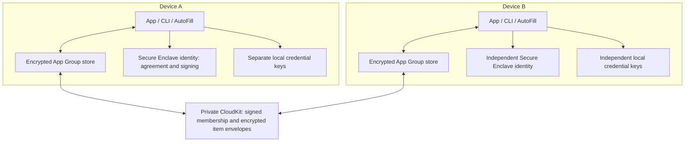
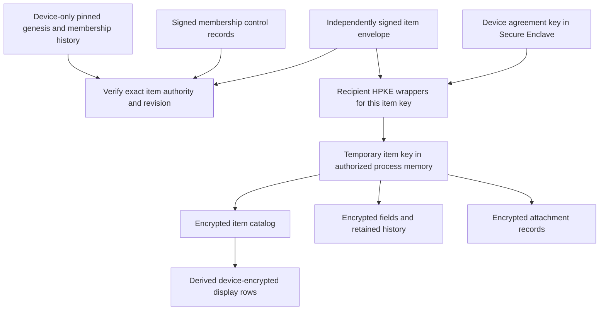

# Security and key management

2ndPass is a development preview, not an independently audited credential store.
This document describes the current item service used by the app, CLI and AutoFill.
It distinguishes cryptographic checks, platform dependencies, intentional disclosure
and unfinished capabilities. See [vault architecture](VAULT.md) for the format,
[validation](VALIDATION.md) for acceptance, and [the public explanation](https://2ndpass.app/security.html)
for a less technical introduction.

## Trust boundaries and threat model

Vault contents are encrypted before storage or upload. Access is granted to device
public keys; independently signed items are verified against separately pinned
membership authority. These protections depend on several distinct boundaries:

- **Device hardware and Apple platform security:** Secure Enclave protects private
  key operations. Keychain, code signing, provisioning and local authentication
  control access to device identities. The application does not implement these
  hardware or OS security boundaries itself.
- **Authorized application code:** plaintext and temporary symmetric keys enter
  the authorized process. Code controlling that process can request permitted
  hardware operations and retain the results.
- **Same-account bootstrap:** the authenticated private CloudKit container is an
  explicit trust channel for automatic device admission. An attacker able to write
  through that channel may obtain membership while an existing unlocked device
  processes the request. Account credentials alone are not arbitrary container
  write authority; the composed account/client/container boundary matters.
- **Pinned authority and local versions:** independently retained membership pins
  constrain subsequent authority changes. Known item revisions constrain replay.
  Neither provides an independent initial account identity, global inventory
  completeness or proof that the server returned its newest data.
- **Recipients of plaintext:** clipboard destinations, filled applications, CLI
  children and exported files receive secrets intentionally. Vault encryption
  cannot govern their subsequent use or retention.

CloudKit transport authorization and application cryptographic authorization are
separate controls. A copied encrypted store alone does not supply device private
keys. Active control of the trusted account/container channel has the additional
enrollment consequences described above. The model does not promise availability
against a malicious server, secrecy from an authorized recipient, or protection
of plaintext on a compromised endpoint.

## Devices, vaults, and keys

### Devices and local identities

Cloud-access identity keys and device-local credential keys serve different jobs.
Both use Secure Enclave hardware, but the former unwrap item keys and sign vault
operations while the latter perform SSH, Git, passkey or certificate operations.

The diagram's cloud arrows represent encrypted record transfer by the authorized
sync owner. Local credential keys never travel along them. Each client authenticates
separately even though clients on one device share storage and identity access.

### Inside a cloud vault

Each item has an encrypted catalog and encrypted record map, protected by its item
key. Attachment ciphertext is inside the item envelope, not an independent lazy
blob service. The derived display catalog has a separate device-wrapped key and is
not uploaded. Portable archives use an independent generated archive key; there is
no active account-recovery recipient workflow in this service.

## Hardware keys, Keychain and authentication

### What the Secure Enclave does

The Secure Enclave is an isolated hardware security subsystem. 2ndPass creates two
separate P-256 private keys per device: a key-agreement key used to open encrypted
item-key envelopes, and a signing key used to authenticate requests, item updates and membership changes. Private scalar values are not exported to 2ndPass. The shipping
`EnclaveDevice` provider requires `SecureEnclave.isAvailable` and has no software
fallback. Software key providers used in tests do not establish hardware behavior.

Apple's [Secure Enclave overview](https://support.apple.com/guide/security/sec59b0b31ff/web)
and [key protection documentation](https://developer.apple.com/documentation/security/protecting-keys-with-the-secure-enclave)
describe the platform boundary. 2ndPass uses its P-256 operations; it does not run the
whole vault engine, AES record decryption, or the UI inside the Enclave.

### What is stored on the device

The Keychain is Apple's OS-managed credential store, distinct from the Enclave.
2ndPass persists opaque, device-bound representations of the two hardware keys in
the Data Protection Keychain. These are not portable private scalars or a
recoverable backup of the device identity. The items are non-synchronizable,
scoped to 2ndPass's signing access group, and use `WhenUnlockedThisDeviceOnly`.
Copying their bytes, local vault storage or CloudKit records does not reveal the
underlying private keys or let them be moved to another machine. 2ndPass holds
opaque CryptoKit key references and asks the Secure Enclave to perform private-key
operations; decrypted item keys and secrets are outside that hardware boundary.

Keychain access groups, provisioning and hardened-runtime validation constrain
which signed clients can use these representations. They are not defenses
against malicious code already executing with an authorized client's privileges.
Deleting the Keychain identity removes usable local references; it is not proof
of physical zeroization of every hardware or storage location.

### What unlocking authorizes

Key access controls use `privateKeyUsage` and `userPresence`. 2ndPass preauthorizes an
`LAContext` (Apple's local-authentication context) using device-owner
authentication, then disables unexpected interactive prompts during key
operations. This is the platform's authentication policy, not a promise that
biometrics are the only permitted authentication method.

The GUI may reuse that authorization until session lock or expiry. Therefore a
successful operation need not produce a fresh prompt. CLI sessions end with their
command; AutoFill starts fresh authorization and locks after each fill. Providers
release hardware-key handles after operations. Session lock invalidates the
context and session generation, cancels work, and rejects late results.

Invalidating an `LAContext` is **not established as revoking an already-used
signing handle**: a real-host probe found signing still succeeded through such a
handle. 2ndPass consequently clears handles and independently guards operation and
session state. In-flight hardware operations or submitted cloud mutations may
finish after cancellation; durable pending mutations and receipts reconcile cloud outcomes.

## Encryption and plaintext lifetime

Each item uses a random 256-bit AES-GCM key. Its catalog and records are separately
authenticated, with fresh nonces when encrypted. HPKE using
`P256_SHA256_AES_GCM_256` wraps the item key for each authorized device. The private
agreement key stays in hardware; unwrapped symmetric keys do not.

The current `2ndpass-item-envelope-2` header binds vault and item UUIDs, version,
monotonic revision generation, encryption-key generation, base version, membership
state digest and author. The signature covers the header, encrypted catalog,
encrypted records and recipient wrappers. Signature, catalog, recipient-key and
record contexts use distinct domains. Recipient contexts bind the exact membership
state and recipient; record contexts bind vault, item, key generation and record ID.

Revision generation is distinct from encryption-key generation. Selective edits can
reuse unchanged ciphertext while generating fresh identities for changed records.
This avoids decrypting every concealed field for a metadata edit, but the complete
envelope still transfers. Membership addition changes wrappers and authority; it
is not a secret rotation or revocation operation.

A normal explicit secret read proceeds through these boundaries:

1. Check the authenticated session, account binding, selected vault and pinned
   authority; obtain the authoritative locally stored item version.
2. Resolve its exact identity or name using version-checked catalog/index data.
   A derived display row alone cannot authorize a secret read.
3. Verify the item envelope against independently selected vault/item IDs and
   the exact trusted membership state. Open this device's item-key wrapper.
4. Authenticate and decrypt the requested record in application memory, then
   return it to the requested UI, AutoFill, clipboard or command destination.
5. Release operation-specific key handles and temporary keys. Wipe owned secret
   buffers where practical and reject results whose session became invalid.

AES keys, HPKE-derived state, edited values, passwords and command inputs reach
process memory. Password-strength calculations also see plaintext. Swift strings,
Foundation/CryptoKit copies, allocators and OS frameworks prevent a comprehensive
memory-erasure guarantee. Per-item keys bound an individual key's exposure, but an
authorized client can deliberately read many items.

## Device-local display acceleration

The item backend persists a device-local encrypted display catalog. Each vault
has a random symmetric catalog key wrapped to its device identity; the wrapping
is signed and scoped to the pinned genesis, account, database, owner and vault.
Independent AEAD rows bind item/version/key identities. The plaintext catalog key
is retained only during an authorized session and released on app lock or authority
invalidation. This is an additional in-process metadata key, not an item decryption
key. Its ciphertext lives in the nonsynchronized, backup-excluded app-group store.

The catalog includes titles, visible fields, tags, list/search metadata and record
references. It excludes concealed field values, attachment bodies and item keys.
It is disposable acceleration: matching local source versions and authenticated
rows are required for reuse, source records remain authoritative for mutations
and secret reads, and tampered/stale rows are rebuilt. It does not establish cloud
freshness or add protection against complete local-store rollback. Permission and
account invalidation still supersede cached metadata. Device compromise while the
app is authorized can expose this metadata, as it can the existing plaintext view.

Catalog content includes notes when they are visible/searchable metadata. Passwords,
OTP seeds, private-key contents and attachment bodies stay out of display rows.
Projection commits compare both source versions and the current cache-key envelope
inside a repository transaction; a stale cross-process projection cannot overwrite
newer derived state. Damaged keys reset derived rows, not authoritative items.
Cache writes do not themselves queue cloud mutations.

The separate encrypted name index is likewise disposable lookup acceleration. Its
signature and device context do not make an old authentic index current: item-version
comparison remains necessary. Duplicate names must not silently select or merge the
wrong item. Complete catalogs, exports and mutation validation cannot treat partial
background display projection as a complete inventory.

## Composed Apple + 2ndPass trust model

### Account and enrollment trust

Apple authenticates the iCloud environment. Code signing, provisioning and CloudKit
entitlements constrain native client access to the private container. 2ndPass then
checks scoped signed enrollment requests, signed membership authority and the
joining device's ability to decrypt metadata before installing device-only trust.
No private iCloud Keychain trust-circle API is queried.

Ordinary same-account connection deliberately requires no second human comparison
or approval ceremony. An existing device must be unlocked to use its hardware keys;
iCloud authentication cannot unlock them on its behalf. Protect account recovery
channels and trusted devices as well as the local application.

A valid signature by a new identity proves possession of its signing key, not the
user's intent or that its implementation uses Secure Enclave. The production native
provider requires hardware, but the protocol does not remotely attest another
client's binary. A self-signed genesis is not an independent trust anchor.

## Identity, membership and enrollment

### Accounts, devices and roles

An account scope derives from the CloudKit container, environment and opaque account
record ID. It is a namespace, not a decryption key. Device identities contain
independent agreement and signing public keys. Local trust additionally binds the
database, zone owner, vault and pinned genesis.

`MembershipEnvelope` is a separate signed chain with format
`2ndpass-membership-1`. A successor binds its parent digest and next generation;
its signature is checked using the parent's owner authority, not a role newly
asserted by the successor. Structure checks preserve removed-device history and
reject changing an existing device's keys in place. These protocol checks do not
make device removal or cross-account role management available to clients.

### Automatic same-account enrollment

Private vault discovery does not itself install trust. The joining device creates
a scoped signed request with its exact keys and persists the request transcript.
An existing unlocked device checks it, stages encrypted replacements durably,
conditionally advances the signed membership head, then activates the local item
and outbox batch. Lost acknowledgements retry the same operation.

The joining device verifies its exact original request, account/container/environment,
vault and device bindings, signed history and metadata decryption before installing
a pin. Existing independent pins and immutable successor checkpoints cannot be
replaced by a cloud-supplied root. Request expiry bounds new approval; an already
issued valid grant remains resumable. Retained canceled/restarted transcripts allow
recovery of a grant issued concurrently with cancellation.

Additive admission rewraps item keys while preserving concealed-field, history and
attachment ciphertext. The admission path checks that the successor is precisely
the expected addition; key reuse is not a general permission for removal, role or
recovery changes. Durable membership catch-up handles older locally held envelopes
under the current authority instead of treating their signatures as current by fiat.

The joining device opens verified vault metadata before background item download.
A signed item-count hint includes tombstones and excludes the metadata record. It
supports persistent initial-download progress, not global inventory completeness.
Foregrounding, unlock and cloud notifications resume discovery/enrollment; an empty
local database is not proof of an empty iCloud account.

### Existing-device reconnect grants

A signed same-account enrollment request from an exact identity already present
in current membership may receive a reconnect grant. This uses the current
membership as both the final history state and successor, with the usual signed
request, scope, author, timestamp and count fields. Verification requires the
exact device keys, not just its UUID, and a current owner signer. It does not
change membership or rewrite encrypted items. Older clients reject this grant
form and require an update. The private CloudKit account remains the bootstrap
trust boundary. Retained independent pins are never replaced: rebuilding a
missing store requires matching scope, genesis and digest, authenticated metadata
and compatible pinned history. A different source grant is accepted against an
existing pin only for this reconnect case with no initialization receipt.

### Cross-account sharing and removal

Cross-account sharing, device removal, account recovery and permanent vault deletion
are unavailable through the current service. Protocol types, primitive operations
and test fixtures do not establish a user-facing implementation. Sharing requires
both transport permissions and cryptographic authorization, with separate physical
accounts and permission/revocation acceptance before release.

Future removal must distinguish membership exclusion from key rotation and external
credential revocation. An old recipient can retain plaintext, keys and ciphertext.
An offline client cannot learn a change it has not observed. Changing a password or
revoking a key at its service is necessary when copied credentials must stop working.

## Authenticity, tampering and synchronization

### Independent items and authority

Item verification takes independently selected destination IDs and trusted membership;
a record cannot define its own authority. Signatures bind the exact ordered authority
state, not merely a hash of an untrusted roster. Known older per-item revisions and
equal-revision forks are rejected, while a client can catch up across skipped
intermediate item revisions. An authorized editor can still create harmful content
at a higher revision.

There is no vault-wide publication chain proving the entire item set. CloudKit can
omit items, withhold updates, delete ciphertext or deny service. A valid local view
is not proof of current remote freshness. Restoring an entire older local store may
remove version evidence. Independent Keychain pins constrain authority replacement,
but do not turn local item versions into a global freshness oracle.

Known obsolete-authority writes are quarantined. Without a global publication fence,
a stale writer may still submit old-key ciphertext; rejection after upload cannot
undo that disclosure. Membership changes and secret rotation must be evaluated as
separate security operations.

### Local commits, receipts and process ownership

The Core Data repository atomically stores encrypted item changes and pending
mutations. Persistent history and process notifications refresh clients; CKSyncEngine
owns native change tokens, scheduling and transfer. Automatic Core Data CloudKit
mirroring is not enabled alongside it. One process holds the synchronization lease
per account/database. The CLI uses the shared store and requests work or acquires
the lease; AutoFill does not run a competing long-lived synchronization owner.

A local transaction is the durability boundary. GUI save success acknowledges that
transaction, not an unconfirmed upload. CLI writes normally wait up to 20 seconds
for their exact cloud delivery receipts. `--local-save` returns after local commit;
`--offline` prevents networking. A timeout preserves pending work, returns receipt
identifiers and exits nonzero. Repeating that mutation can create unintended edits.

Lock and account changes invalidate authorization and gate pending work. A lock
observed after a completed transaction cannot undo the save; outcome reporting must
distinguish a completed-but-locked result from a precommit failure. Already submitted
hardware/cloud operations can finish after cancellation. Durable state, not a canceled
UI task or a background notification, determines their eventual outcome.

### Provisioning and missing zones

Local initialization pins the exact bootstrap scope/source before atomically creating
membership, items and pending work. Reopening or retrying preserves that authority
and later edits. Cloud provisioning persists commissioning intent before publishing
control records and verifies the required signed history/head before item upload.

A missing zone after control publication may have reached CloudKit is a recovery
condition, not permission to silently recreate it. A network error alone does not
prove absence. See [CloudKit schema and provisioning](CLOUDKIT.md).

### Conflicts and interrupted delivery

The repository preserves local and remote conflicting versions. Unresolved conflicts
block affected publication, rather than silently choosing one secret. Explicit
resolution is guarded by the full reviewed snapshot so a stale review cannot replace
newer data. Discarded local delivery receipts become superseded, not cloud-confirmed.
Metadata previews and explicit secret reveals retain authentication boundaries.

Conflict-review integration and physical concurrent-edit acceptance remain release
work. Quarantine recovery and bounded cleanup of staging, receipts and retained
state also remain work. Invalid signatures must not authorize a local overwrite;
missing or unreadable assets must not be treated as successfully ingested data.

## Offline access and account changes

Local reads and item edits work without network access after authentication. Pending
changes survive restart and resume when an authorized sync owner can run. Physical
iOS lock may make the protected store unavailable, and background execution is
opportunistic. Push notifications are hints, not delivery guarantees.

Device-only account bindings permit scoped local access. Observed account changes
invalidate the binding and sessions; a disconnected client cannot detect unobserved
remote account changes or establish cloud freshness. Offline access is not a bypass
of authentication, and it is not evidence that a remote credential or permission
still exists.

## Recovery and backups

### Portable archives

A portable `.moparchive` is an authenticated logical export encrypted with a separately
generated key independent of device identities. Both archive and key are needed to
restore into a new owned vault. Anyone holding both can decrypt transferable contents;
protect and store them separately. This is a different security boundary from copying
a device's encrypted database without its hardware keys.

Archives preserve locally available fields, metadata, retained history, trash,
attachments and cloud software credential bytes. They do not export hardware private
keys, reinstate device membership or restore account recovery configuration. Hardware
registration references are informational, not private-key backups.

The current exporter cannot certify complete remote inventory. A successful export
only establishes an export of the local state it accepted; verify downloads and
restored contents before discarding source data. The format is bounded at 256 MiB;
invalid or oversized inputs fail rather than silently omit data. Output refuses
existing files. A restore uses a fresh UUID retained for retries and creates an
independent vault. A dry run validates without creating it.

See [backup and restore](BACKUPS.md) and the [standalone archive specification](formats/PORTABLE-BACKUP-v1.md)
for exact framing, key encoding, limits and retry semantics. Keep an independent
copy of that specification with recovery materials so restoration does not depend
solely on an installed application.

### Losing devices or the Apple Account

Account-wide recovery of a live cloud vault is unavailable. If an enrolled device
survives, keep it unlocked while a new device connects on the same Apple Account.
Otherwise an independently retained portable archive and key provide a restore path
for their contents. Neither mechanism recovers the Apple Account itself.

Device-local Secure Enclave credential keys cannot be backed up, moved or recovered.
Register independent credentials or service recovery methods before device loss.
No UI or protocol primitive should be presented as a working live-vault recovery
workflow until integration and physical acceptance are complete.

## Metadata and intentional disclosure

Cloud-visible information includes record/vault identifiers, public membership and
key relationships, ciphertext sizes and update timing. Enrollment relays expose
public request identity/scope information inside the private account channel.
Vault names and item catalogs are encrypted. Encryption does not hide usage patterns
or make membership metadata secret from the storage provider.

The device-encrypted display catalog includes visible/search metadata, including
notes, and is available in plaintext while the session is authorized. Recent-use
tracking remains device-local and outside cloud synchronization and portable backups.

AutoFill intentionally publishes website, username and credential-kind/locator
metadata to Apple's credential identity store. Passwords and OTP seeds are not in
that index. Selection is resolved from authenticated authoritative data before use.
Suggestion metadata is a privacy tradeoff for credential discovery, not proof that
a stale suggestion is still authorized.

## CLI and extension disclosure boundaries

`sp read` emits plaintext to stdout or the selected output file. `inject`
emits a plaintext rendering to stdout or a generated file and inserts values
literally, without destination-format escaping. `run` resolves references into
the launched program's environment. The child, its dependencies and any
subprocesses receiving those variables become part of the trusted computing base
for the released secrets. Environment variables are not encrypted storage: the
recipient, inherited descendants, diagnostic tooling or sufficiently privileged
host software may expose them. Output files default to mode 0600; permissions do
not encrypt them or prevent authorized readers, backups or later copies.

Default `run` masking filters exact secret bytes in captured stdout/stderr. It
cannot constrain transformed output, direct file writes, network traffic or what
an arbitrary child does with plaintext. `--no-masking` disables that filter.
These are necessary disclosure boundaries for developer automation, not an
extension of vault encryption to the receiving process.

The sandboxed app, separately distributed CLI, and AutoFill extension intentionally
share the provisioned Keychain access group and device identity on a device. The
CLI has its own `.CLI` App ID/profile and remains unsandboxed for developer
automation. Its signature authorizes only the existing shared vault groups and
CloudKit container. The extension has its own
App ID/profile, shares the App Group's encrypted store and suggestion index, and can access
the same CloudKit container. This makes extension code part of the vault's
trusted computing base, not a metadata-only helper. Each fill authenticates
freshly, re-resolves the locator against verified data, and hands a plaintext
credential to AuthenticationServices and the receiving app/site. OS protections
and recipient behavior govern it afterward. See [AutoFill](AUTOFILL.md).

A sufficiently privileged attacker on an unlocked endpoint may invoke authorized
Enclave operations and observe item keys, secrets, clipboard data, AutoFill or
CLI destinations even if it cannot extract the non-exportable device private
key. Extraction resistance and resistance to key use are different guarantees.

## Apple Passwords / iCloud Keychain

Secure Enclave protection is not unique to 2ndPass. Apple documents substantial
hardware-backed protection in [Keychain data protection](https://support.apple.com/guide/security/secb0694df1a/web).
Apple Passwords/iCloud Keychain is integrated deeper into the operating system;
its full implementation is not publicly inspectable. 2ndPass makes its
non-exportable device identity and per-item wrapping an explicit, inspectable
part of its end-to-end vault protocol. This is a concrete design distinction,
not evidence that 2ndPass is categorically more secure. Source availability enables
inspection but does not substitute for professional review.

## Common attacks and practical limits

### Reading secrets from memory

Malware may try to inspect an unlocked password manager's process. 2ndPass keeps
long-lived device private keys inside the Secure Enclave and decrypts concealed
fields on demand. Its unlocked display session holds visible metadata and the display-catalog key,
not a persistent cache of revealed passwords or unwrapped item keys.
Owned secret buffers are wiped when released. Locking clears session state and
hardware-key handles, invalidates authentication, and rejects late results.

A password must still enter application memory to be displayed, copied, or
filled, and temporary symmetric keys also enter memory. These measures reduce
exposure; they cannot defeat an attacker who controls the authorized process or
operating system. Swift strings and framework copies also prevent a guarantee
that every plaintext copy is immediately erased.

### Replacing or modifying the app

A modified binary could attempt to steal passwords as they are used. Apple code
signing, provisioning, and Keychain access groups restrict access to the stored
device identity. The macOS client checks its signing identity and requires the
hardened runtime, with debugger access and library-validation bypass entitlements
disabled. These controls make simply patching or re-signing a binary insufficient
to inherit the legitimate app's Keychain access and constrain code injection.

They depend on the operating system enforcing those boundaries. Malicious code
with an accepted signing identity, or code already running inside an authorized
client, can misuse access after authorization. Device enrollment proves possession
of keys; it is not remote attestation that a device runs an approved binary.

### Capturing copied or displayed passwords

Concealed fields, timed re-concealment, and the locked screen reduce casual visual
exposure. Secret clipboard writes are local to the device and expire; locking
also clears the app's clipboard content when it has not been replaced. These
controls shorten exposure, but cannot retract a password that a clipboard reader,
screen capture, or receiving application has already copied.

### Threat comparison

| Scenario | Protection | Boundary or remaining risk |
| --- | --- | --- |
| Copied encrypted local/cloud records | Per-item encryption and device-specific wrappers | Authorized account/container control may additionally permit automatic enrollment; plaintext exports are outside this boundary. |
| Stolen portable backup | Independent archive encryption | Possession of the separate archive key enables decryption. |
| Stolen locked device | Hardware-bound keys, Keychain accessibility and local authentication | Depends on platform security and authentication credentials; unlocked sessions expose more. |
| Modified or re-signed client | Signing, provisioning, Keychain access groups and macOS hardened-runtime checks | Malicious code with accepted privileges can misuse authorized operations; enrollment is not binary attestation. |
| Tampered item or fabricated role | AEAD, item signatures and independently pinned membership history | Authorized writers can make harmful valid edits; initial admission trusts its bootstrap channel. |
| Replayed items or omitted updates | Known per-item revision checks and signed authority ancestry | No global freshness/completeness proof; older whole-store restoration can remove item evidence. |
| Replayed enrollment | Exact request, scope, identity, approval-time and history checks | A fresh valid identity can still join through a compromised trusted account channel. |
| Malware reading process memory | Concealed fields opened on demand; owned buffers cleared where practical | Temporary keys, visible metadata and requested secrets enter memory; not all framework copies can be wiped. |
| Clipboard reader or screen capture | Concealment, reveal timeout and expiring device-local secret copies | Already captured plaintext cannot be retracted. |
| Recipient retains data | No claim of retrospective secrecy | Device removal is unavailable; even future rotation cannot invalidate copied external credentials. |
| All enrolled devices lost | Portable archive plus its separate key | No active live-account recovery; hardware credential keys cannot be recovered. |

## The device-local `local` vault

`local` is intentionally distinct from portable encrypted cloud vaults. Its
asymmetric private keys are generated inside the Secure Enclave and never become
exportable plaintext in application memory. The dedicated `MopLocalIdentity`
module cannot call CloudKit or the cloud vault engine. Public DTOs contain no
opaque references; non-synchronizable, device-only Keychain records hold those
references. Cloud operations reject local selections before account discovery,
authentication, or transport use. Portable backup/restore applies to transferable cloud-vault contents, not these keys.

A copied application directory or cloud compromise cannot reconstruct a local
private identity on another device. Key references are not a recovery mechanism.
Device loss or erasure permanently removes access; register independent SSH keys,
passkeys, or certificates on other devices beforehand. 2ndPass cannot back up,
escrow, or restore these keys. Imported private keys remain ordinary cloud-vault
secrets and cannot be reclassified as local identities.

Hardware isolation does not prevent operation-oracle abuse by malware controlling
an unlocked authorized process. Authorization scopes limit identities, purposes,
operations and lifetime; they do not attest a trustworthy endpoint. Inputs, public
metadata, signatures and key-agreement results exist outside the enclave. ECDH
results are symmetric secret material in normal memory, although the identity’s
private asymmetric key stays inside the enclave. External review should cover
session revocation races, cross-process deletion, Keychain accessibility and access
groups, protocol parsing, relying-party binding, and same-device reference deletion.

Device-bound WebAuthn responses always report BE=0/BS=0; having another independent
passkey is not backup eligibility for the first credential. Apple credential-provider
acceptance of these flags requires physical-device validation and may prevent use
on current platforms. See [local vault operation and acceptance](LOCAL-VAULT.md).
2ndPass is not FIPS certified and makes no blanket Apple-module certification claim.

### SSH agent caller authorization

The local SSH agent authenticates only after receiving a valid signing request;
public-key enumeration needs no authentication. Wrapped-command mode restricts
connections to the recorded command process instance and its current descendants.
Standalone approvals are scoped to the exact kernel-audited process instance and
identity, defaulting to five minutes, rather than all clients with the socket path.
macOS peer audit tokens and `proc_pidpath_audittoken` detect exited/reused/exec-changed
peers; process start times and repeated ancestry checks bind wrapped requests to
the launched command. Unverifiable callers fail closed. Inputs are purpose-checked
before authentication and authorization/caller validity is checked again before
returning signatures. Stop cancels pending authentication and revokes cached contexts.
Device lock/sleep and user-session switching stop the agent, as does the 12-hour
session limit. Wrapped command exit revokes its approvals immediately.

This is an operation-access boundary, not protection against code injection into
an authorized process. A cooperating authorized process can relay requests or
pass its socket; peer identity does not authenticate the original source behind
such a relay. Destination binding and forwarding restrictions are not implemented.
The system authentication prompt identifies the local executable and key but does
not claim a verified remote host. Physical-device review must exercise Touch ID,
lock/sleep during an outstanding prompt, and late Secure Enclave results.

### Cloud software key credentials

Typed cloud SSH/Git credentials and passkeys store normalized software private keys
as concealed encrypted item payloads, with public protocol metadata inside the
encrypted catalog. Authorized members can obtain software key material; these
credentials do not inherit Secure Enclave non-extractability. Key creation/use routes through authenticated item catalog/read/save operations. Cross-account sharing, device removal and account recovery are unavailable. Portable archives preserve software key bytes, not proof of external service registration. Hardware keys remain
non-exportable and never enter this format. See [supported cloud keys and
validation limits](CLOUD-KEY-CREDENTIALS.md).

## Password health and retained secrets

Password checks intentionally decrypt eligible passwords. Reuse detection uses a
fresh in-memory HMAC key per scan. Breach checks send a five-character SHA-1 prefix
to the Pwned Passwords range API with padding, not the password, full hash, account
name or website. The service sees the network address. Disabled, incomplete and
failed checks must remain distinguishable from a clean result.

Health-result caching and per-item history use encrypted item-service state. Previous
password/token values remain secrets protected by their item encryption. Local commit
establishes the edit and retained history even if delivery is delayed. Clearing live
history cannot erase prior archives, copied ciphertext or plaintext already disclosed.
Credential-account registration and redundancy management are not connected; generating
a second local key does not establish that a service accepts it as an alternate.
See [security health and history](SECURITY-HEALTH.md).

## Evidence and source map

The user reported portable backup/restore, large-vault responsiveness, CLI lookup
and automatic same-account enrollment acceptance on October 3, 2026. On October 4,
an iPhone-created item reached Mac and iPad, a Mac edit reached both devices, and an
offline iPhone edit uploaded on reconnection without manual Refresh. These observations
cover those scenarios, not all interruption, concurrency or account-change cases.

Software fixtures and simulator builds do not prove hardware key behavior, real
CloudKit permissions, Production readiness or physical AutoFill acceptance. Independent
security review remains outstanding. Protocol design and implementation correctness
are separate questions; source availability alone establishes neither. Dated source
reviews apply to their reviewed revisions, not automatically to the current service.
See [validation and remaining gates](VALIDATION.md).

Principal implementation entry points:

| Boundary | Source |
| --- | --- |
| Device keys, access controls and handle lifetime | [Device.swift](../Sources/MopVaultNext/Device.swift), [DeviceKeychain.swift](../Sources/MopVaultNext/DeviceKeychain.swift) |
| HPKE and canonical encoding | [Crypto.swift](../Sources/MopVaultNext/Crypto.swift) |
| Independent item signatures and encryption | [ItemEnvelope.swift](../Sources/MopVaultNext/ItemEnvelope.swift) |
| Membership authority | [MembershipEnvelope.swift](../Sources/MopVaultNext/MembershipEnvelope.swift), [TrustedMembershipHistory.swift](../Sources/MopVaultNext/TrustedMembershipHistory.swift) |
| Device-only trust pins | [KeychainItemVaultTrustStore.swift](../Sources/MopAppSupport/KeychainItemVaultTrustStore.swift) |
| Enrollment requests, grants and admission | [DeviceEnrollment.swift](../Sources/MopVaultNext/DeviceEnrollment.swift), [ItemDeviceEnrollment.swift](../Sources/MopAppSupport/ItemDeviceEnrollment.swift), [VaultAdmission.swift](../Sources/MopSync/VaultAdmission.swift) |
| Derived display and name data | [LocalDisplayCatalog.swift](../Sources/MopVaultNext/LocalDisplayCatalog.swift), [LocalNameIndex.swift](../Sources/MopVaultNext/LocalNameIndex.swift) |
| Session and client routing | [ItemVaultSession.swift](../Sources/MopAppSupport/ItemVaultSession.swift), [ItemVaultService.swift](../Sources/MopAppSupport/ItemVaultService.swift) |
| Atomic persistence, conflicts and receipts | [EncryptedItemRepository.swift](../Sources/MopSync/EncryptedItemRepository.swift), [MutationDeliveryWaiter.swift](../Sources/MopSync/MutationDeliveryWaiter.swift) |
| Synchronization and ownership | [CloudKitSyncAdapter.swift](../Sources/MopSync/CloudKitSyncAdapter.swift), [SynchronizationLease.swift](../Sources/MopSync/SynchronizationLease.swift), [ItemVaultSyncRuntime.swift](../Sources/MopAppSupport/ItemVaultSyncRuntime.swift) |
| Bootstrap and cloud commissioning | [ItemVaultBootstrap.swift](../Sources/MopAppSupport/ItemVaultBootstrap.swift), [ItemVaultProvisioner.swift](../Sources/MopAppSupport/ItemVaultProvisioner.swift) |
| AutoFill resolution and publication | [AutoFillSession.swift](../Sources/MopAppSupport/AutoFillSession.swift), [AutoFillPublicationState.swift](../Sources/MopAppSupport/AutoFillPublicationState.swift) |

The [vault architecture](VAULT.md), [CloudKit schema](CLOUDKIT.md), [account identity](ACCOUNT-IDENTITY.md)
and [portable archive specification](formats/PORTABLE-BACKUP-v1.md) complement this threat model.

## Validation

Release acceptance must include concurrent edits and explicit conflict resolution,
restart/interruption, lock during operations, account changes, large-vault catalog
repair, backup completeness and restore independence, and signed app/CLI/AutoFill
behavior on supported physical platforms. Sharing, removal and account recovery
need implementation and separate physical acceptance before being claimed supported.
Production provisioning and independent security review remain distinct gates.
